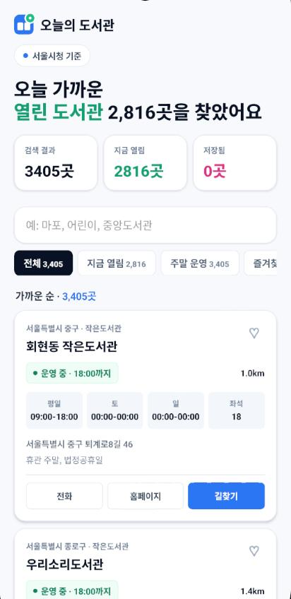
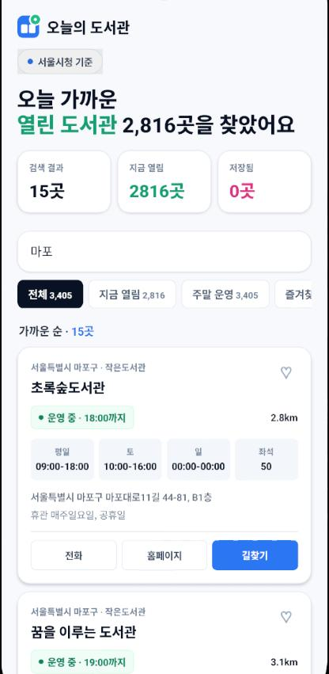
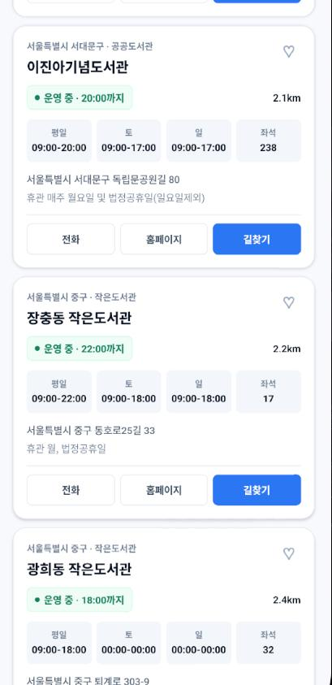

# 오늘의 도서관

전국 공공도서관 운영 정보를 **지금 열린 순·가까운 순**으로 보여주는 React Native(Expo) 앱입니다.

## 배포 주소

| 서비스 | URL |
|--------|-----|
| **API · 랜딩** | [https://today-library-sigma.vercel.app](https://today-library-sigma.vercel.app) |
| **도서관 데이터 API** | [https://today-library-sigma.vercel.app/api/libraries](https://today-library-sigma.vercel.app/api/libraries) |
| **개인정보 처리방침** | [https://today-library-sigma.vercel.app/api/privacy](https://today-library-sigma.vercel.app/api/privacy) |

앱 패키지: `com.dobedub.todaylibrary`

## 스크린샷

### 홈 — 열린 도서관 목록



### 검색 — 마포 지역



### 도서관 카드 — 운영시간·길찾기



## 포함된 기능

- 현재 위치 기준 가까운 도서관 정렬
- 오늘 운영 여부 계산
- 전체 / 지금 열림 / 주말 운영 / 즐겨찾기 필터
- 도서관명, 지역, 주소 검색
- 즐겨찾기 로컬 저장
- 전화, 홈페이지, 외부 지도 길찾기 연결
- Vercel serverless API를 통한 공공데이터 캐시 JSON 연결
- 원격 캐시 실패 시 앱 내장 seed 데이터 fallback

## 실행

```shell
source ~/.nvm/nvm.sh
nvm use 20
npm run ios
npm run android
```

Expo Go / 개발 클라이언트:

```shell
npm start
```

태블릿·웹 스크린샷용:

```shell
npm run web -- --port 8086
```

## 공공데이터 캐시 API

앱은 공공데이터 API 키를 직접 들고 있지 않습니다. Vercel serverless 함수가 공공데이터포털 `전국도서관표준데이터`를 가져와 `/api/libraries` JSON으로 노출하고, 응답에는 하루 CDN 캐시를 겁니다.

```shell
cp .env.example .env.local
```

`.env.local`에 아래 값을 채웁니다.

```shell
PUBLIC_DATA_SERVICE_KEY=공공데이터포털_인증키
CRON_SECRET=긴_랜덤_문자열
PUBLIC_APP_URL=https://today-library-sigma.vercel.app
EXPO_PUBLIC_LIBRARY_API_URL=https://today-library-sigma.vercel.app/api/libraries
```

로컬에서 API만 확인하려면:

```shell
npm run api:dev
curl http://localhost:3000/api/libraries
```

앱을 로컬 API에 붙여 보려면 `EXPO_PUBLIC_LIBRARY_API_URL=http://localhost:3000/api/libraries`로 설정한 뒤 Expo를 다시 시작합니다. Expo public env는 번들 시점에 들어가므로 값을 바꾼 뒤에는 앱을 재시작해야 합니다.

공공데이터 API endpoint는 `src/data/libraries.ts`의 `PUBLIC_DATA_ENDPOINT`에 기록해두었습니다.

## Vercel 배포

Vercel 프로젝트 환경 변수에 아래 값을 넣습니다.

- `PUBLIC_DATA_SERVICE_KEY`: 공공데이터포털에서 발급받은 서비스 키
- `CRON_SECRET`: cron endpoint 보호용 랜덤 secret
- `PUBLIC_APP_URL`: production 도메인 (`https://today-library-sigma.vercel.app`)

`vercel.json`에는 매일 18:00 UTC, 한국 시간 03:00에 `/api/cron/refresh-libraries`를 호출하는 cron이 들어 있습니다. Hobby 플랜의 cron 제한을 고려해 하루 1회로 설정했습니다.

배포 후 Expo/EAS 빌드 환경에는 아래 public 값만 넣습니다.

```shell
EXPO_PUBLIC_LIBRARY_API_URL=https://today-library-sigma.vercel.app/api/libraries
```

이 값은 앱에 공개되어도 되는 캐시 JSON 주소입니다. `PUBLIC_DATA_SERVICE_KEY`는 앱 환경변수로 넣지 않습니다.

## 스토어 준비 체크

- Apple Developer Program: 연 99 USD
- Google Play Console: 1회 25 USD
- Google Play 개인 신규 계정은 closed test 12명 / 14일 조건이 필요할 수 있음
- 위치 권한 문구는 `app.json`에 설정됨
- 지도 SDK를 넣지 않고 외부 지도 앱을 열기 때문에 지도 API 과금은 없음
- Play 스토어 등록 자료: [`docs/play-store-listing.md`](docs/play-store-listing.md)
